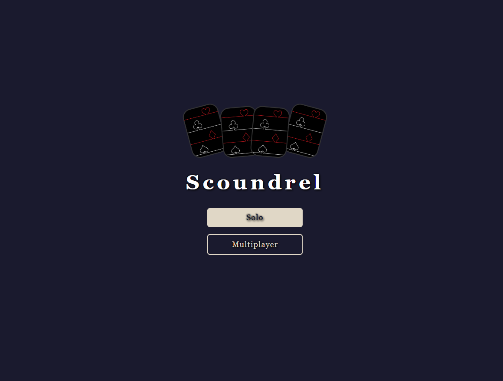

# Scoundrel PvP

A multiplayer adaptation of the solitaire card game [Scoundrel](https://www.scoundrelgame.com/) by Zach Gage and Kurt Bieg. Two players face each other in a deadly dungeon, using weapons, potions, and wit to survive. The server acts as the source of truth, ensuring a fair and synchronised experience.


*Lobby – create or join a game room.*

---

## 📜 Game Rules

The game uses a standard 52‑card deck with red face cards (J, Q, K, A of hearts and diamonds) removed, leaving 44 cards.  
Each turn, a room of four face‑up cards is dealt.

- **Monsters (♣ clubs / ♠ spades)** – Deal damage equal to their face value.  
- **Weapons (♦ diamonds)** – Equip to block damage. A weapon can only block monsters weaker than the last one it blocked.  
- **Potions (♥ hearts)** – Restore HP equal to their value, up to 20. Only one potion per room.

Players take turns revealing cards from their shared dungeon (the deck).  
The last player standing with HP > 0 when the deck runs out wins.  
You can run away once per room – but not twice in a row!


*Mid‑game view – your dungeon, opponent’s state, and weapon durability.*

---

## ✨ Features

- **Two‑player turn‑based gameplay** over HTTP.
- **JWT authentication** – secure room creation and actions.
- **Persistent sessions** – refresh the page and resume right where you left off.
- **Real‑time synchronisation** – both players must commit their actions before the turn resolves.
- **Responsive UI** – built with Alpine.js, works on desktop and mobile.
- **Self‑contained backend** – single Go binary serves both API and static files.

---

## 🚀 Quick Start (local)

### Prerequisites
- [Go 1.26+](https://go.dev/dl/) (uses extended `new` syntax)
- A modern web browser

### Run the server

```bash
cd server
go run .
